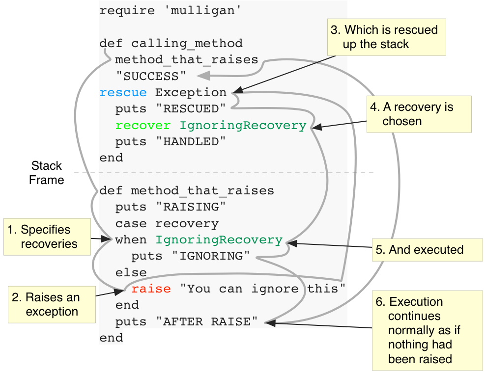

[](https://travis-ci.org/michaeljbishop/mulligan)


"In golf, a mulligan is a stroke that is replayed from the spot of the previous stroke without penalty, due to an errant shot made on the previous stroke. The result is, as the hole is played and scored, as if the first errant shot had never been made." -- [Wikipedia](http://en.wikipedia.org/wiki/Mulligan_(games)#Mulligan_in_golf)

## Usage

### Two Stories

#### The Spy Before Radios Were Invented

> Once upon a time, there was a spy who had to infiltrate a 17 floor building, each new floor thick with guards. On the top floor was a safe to which he was given a combination. The safe would blow up if the wrong combination was used so he had to be careful. After sneaking through all the floors, he successfully arrived at the safe and then he realized on his notes the combination read "66-99-66".
>
> He couldn't tell if he was reading it upside-down, and because radios hadn't yet been invented, Intelligence couldn't be contacted. Not knowing what to do he bailed on the mission by jumping out the window and was rescued on the ground by the allies. They told him he was indeed holding the combination upside-down but now he'd have to again go through all 17 floors.

This the current state of Ruby exception handling. Once an exception is raised, you "abort the mission" and jump out the window where you are rescued.

... but then you have to start the mission again.

#### The Spy After Radios Were Invented

Here's the story again, but let's pretend radios now exist:

> Once upon a time, there was a spy ... It was then that he realized the combination he was given was 66-99-66.
>
> ***Because this mission now includes radios***, he was able to call intelligence, tell them what was happening and they told him he was holding the note upside-down. He then continued the mission by turning the note right-side-up and opening the safe.

The Mulligan gem adds *the radio* to your exception handling. The Ruby `rescue` clause is like 'Intelligence' who receives the call (as an Exception instance), but now attached to that Exception instance are 'recovery objects' which contain data about how to solve the problem. By invoking a recovery object, the code continues to exit without the mission aborting.

### Code Example

Here's a very simple contrived example, simply to show flow control:
```ruby
require 'mulligan'

def calling_method
  method_that_raises
  "SUCCESS"
rescue Exception
  puts "RESCUED"
  recover IgnoringRecovery
  puts "HANDLED"
end

def method_that_raises
  puts "RAISING"
  case recovery
  when IgnoringRecovery
    puts "IGNORING"
  else
    raise "You can ignore this"
  end
  puts "AFTER RAISE"
end
```

Running this at the REPL shows:

```
2.0.0-p353 :009 > calling_method
RAISING
RESCUED
IGNORING
AFTER RAISE
 => "SUCCESS" 
```

Notice that we did't see "HANDLED" in the output? Here's what happened in detail:




## Basic API
### Kernel#recovery

#### To Start A 'case' Statement

`recovery` is used at the beginning of a `case` structure to indicate that each `when` clause is defining a `Recovery` instance to be attached to the next raised `Exception` instance.

Here is the structure for using it:

```ruby
case recovery
when <recovery_class>           # or
  ...code
when <recovery_class>.new(...)  # or
  ...code
when <method_or_statement_that_returns_recovery_instance_or_class>
  ...code
else
  raise <exception>
end
```

The structure for this has to be quite strict. You *have* to put the `raise` inside the `else`. (For more explanation, see the [Appendix](#appendix))

#### To Retrieve a Recovery

You can also call `recovery(<recovery_class>)` when inside a rescue statement to see if there is a recovery attached to the exception that fits that class.

```ruby
rescue Exception => e
  if !recovery(IgnoringRecovery).nil?
    ...
  end
```

### Kernel#recover

Inside a `rescue` clause, this invokes the recovery object. There is no return value from this. Code execution now proceeds back down into the stack to to the location in the case statement that matches the recovery class.

```ruby
rescue Exception => e
  recover(IgnoringRecovery)
```

#### You can pass arguments when calling the recovery.

Here is an example of passing arguments:

```ruby
rescue Exception => e
  recover(IgnoringRecovery, "I'm saving you")
```

Here is an example of retrieving them:

```ruby
begin
case r = recovery
when IgnoringRecovery
  puts r.argv[0]        # will output "I'm saving you"
else
  raise
end
```

### Mulligan::Recovery

`Mulligan::Recovery` is the base class of all recoveries. Use this in the same way you use the `Exception` hierarchy, but for recoveries. You can define your own subclasses with different properties that can be read by the `rescue` clauses.

#### Metadata

One thing to note. There is useful metadata associated with a recovery. This is because if you are running your code inside Pry using pry-rescue and an exception is raised uncaught, Pry will open and you can choose a recovery from the list attached to the exception. Your program will then continue as if the exception were never thrown.

Here is the metadata:

#### 'summary' attribute
This is a human-readable description one-line descriptions of what the `Recovery` does. By default it returns the class attribute, but you can override it in the instance.

#### 'discussion' attribute
This is a detailed discussion of how to use the recovery. Think of it as if you were writing help for a command-line tool and wanted to describe the options and arguments. By default it returns the class attribute, but you can override it in the instance.

If you call `Exception#recoveries.inspect` inside Pry, you will get a string that looks more or less like this:

```
Mulligan::RetryingRecovery
--------------------------
Performs again the last task which caused the failure.
Attributes:
  'count' - The number of times this recovery has been
            invoked. In this way, you can keep track of
            how many times the code has been retried and
            perhaps limit the total number of retries.

Mulligan::IgnoringRecovery
--------------------------
Ignores the exception and continues execution.
If this recovery is attached to an Exception, you may
safely continue.
```

## Ruby Compatibility

[](https://travis-ci.org/michaeljbishop/mulligan)
Mulligan fully supports MRI versions 1.9.3 -> 2.1.1

On all other "compatible" rubies, Mulligan will gracefully degrade to standard exception handling. Though the API will be there, no recoveries will be attached to exceptions. Any calls to the Mulligan API will "pass-through".

This diagram shows what happens to code when running on fully supported Ruby vs. a "compatible" Ruby. Faded code is non-operational or unreachable.

<table width=100%>
<tr>
<th>Fully Supported</th>
<th>Compatible</th>
</tr>
<tr>
<td></td>
<td></td>
</tr>
<tr>
<td></td>
<td></td>
</tr>
</table>

Because of this, adding recoveries to your code is ***all gravy***. By adding recoveries, you are simply making your library more useful on supported rubies and on unsupported rubies, you merely have what you always had.

### Use Cases

The truth is, often when we throw an exception in code, we probably could actually continue if we just knew what to do. Specifying recoveries allows you to suggest some options to the rescuing code.

Not only that, you can apply a recovery strategy to large parts of code by handling exceptions at a high level and recovering from them.

From the Dylan Language Manual:

> A condition is an object used to locate and provide information to a handler. A condition represents a situation that needs to be handled. Examples are errors, warnings, and attempts to recover from errors.

A "condition" is similar to what we are call "exception" in Ruby except that in Dylan and Lisp, conditions don't always represent errors, but are just a way to send messages higher-level code.

#### Fixing network connection errors

```ruby
def http_post(url, data)
  ... networking code...
  raise CredentialsExpiredException if response == 401
  raise ConnectionFailedException if response == 404
end

def post_resource(object)
  ... assemble url and data...
  http_post(url, data)
  rescue Exception => e
    case recovery
    when RetryingRecovery
      retry
    else
      raise e
    end
end

def save_resources
  post_resource(user)
  post_resource(post)
  post_resource(comment)

  rescue CredentialsExpiredException => e
    ... fix credentials...
    recover RetryingRecovery
  rescue ConnectionFailedException => e
    ... switch from wifi to cellular...
    recover RetryingRecovery
end
```

#### Screen Scraping (in Dylan)

[I'm glad I used Dylan (comp.lang.dylan)](https://groups.google.com/d/msg/comp.lang.dylan/gszO7d7BAok/zqVbQlNDKzAJ)

This is going to be inherently messy and for a long-running program like this, potentially painful to restart if the data is found to be incorrect. Much better to just put in some recoveries and choose from them if errors are found.

#### Handling errors in parsers

You might write a parser to read XML or a log file format and it might encounter malformed entries. You can make that low-level parser code much more reusable if you specify a few recoveries in the raised exceptions. Higher level code will have many more choices to handle errors.

#### Ask your friendly Lisp coder. They've been solving these problems for years.

You've always known he (or she) knew Lisp and now you have something to ask him about.

## FAQ

### "Recovery"? What's wrong with "Restart"?

I had to make a hard choice about naming the thing that allows an exception to be recovered from. "Restart" is the word used in Lisp, but because it is used as a verb and as a noun, it makes it hard to know what a Ruby method named `#restart` would do. Does it return a "restart" or does it execute a restart?

Changing the name to a noun subtracts that confusion (though arguably adds some back for those coming from languages where the "restart" name is entrenched).

### Will Mulligan let me resume from all exceptions?

No. If an exception didn't have recoveries attached when it was raised, you will not be able to call them. It is incumbent on the code that raises the exception to add the recoveries so they can control the error-handling flow.

## Influences
- [Beyond Exception Handling: Conditions and Restarts](http://www.gigamonkeys.com/book/beyond-exception-handling-conditions-and-restarts.html) -- (from [Practical Common Lisp](http://www.gigamonkeys.com/book/))
- [Things You Didn't Know About Exceptions](http://avdi.org/talks/rockymtnruby-2011/things-you-didnt-know-about-exceptions.html) (Avdi Grimm)
- [Restartable Exceptions](http://chneukirchen.org/blog/archive/2005/03/restartable-exceptions.html) (Christian Neukirchen)
- [Common Lisp conditions](https://www.ruby-forum.com/topic/179474) (Ruby Forum)

### Acknowledgements
Thanks to [Ryan Angilly](https://twitter.com/angilly) of [Ramen](https://ramen.is) who graciously released the gem name 'mulligan' to be used with this project. If you've got a good software project, consider launching with them.

## Further Reading
- [Dylan Reference Manual - Conditions - Background](http://opendylan.org/books/drm/Conditions_Background)
- [Common Lisp the Launguage, 2nd Edition - Conditions](http://www.cs.cmu.edu/Groups/AI/html/cltl/clm/node312.html)
## <a name="appendix"></a>Appendix

I had to pull off some tricks to achieve the `case` structure in Mulligan. If I had more control over the Ruby Language, my preferred syntax for specifying recoveries would be:

```ruby
raise [Exception [, message [, backtrace]]]
  # ... code that is always executed during a recovery
recovery <Recover class>
  # ... recovery code
recovery <Recover class> => args
  # ... recovery code that uses the args passed back
end
```


## Installation

Add this line to your application's Gemfile:

    gem 'mulligan'

And then execute:

    $ bundle

Or install it yourself as:

    $ gem install mulligan

## Contributing

1. Fork it [http://github.com/michaeljbishop/mulligan](http://github.com/michaeljbishop/mulligan)
3. Commit your changes (`git commit -am 'Add some feature'`)
4. Push to the branch (`git push origin my-new-feature`)
5. Create new Pull Request

## Add Mulligans to your API

Show off your Mulligans! Feel free to add the following html to your repo...

<a href="http://github.com/michaeljbishop/mulligan"></a>

    <a href="http://github.com/michaeljbishop/mulligan"></a>


## Homepage

[http://michaeljbishop.github.io/mulligan/](http://michaeljbishop.github.io/mulligan/)
